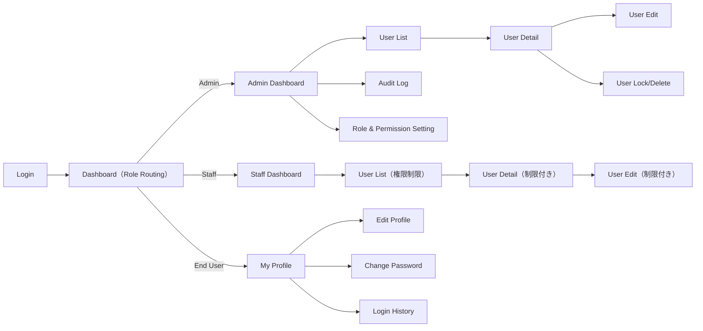
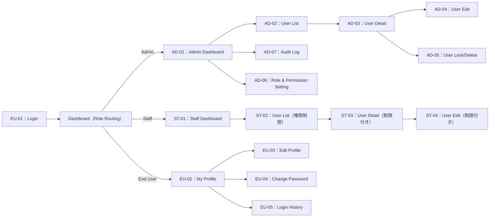

# 要件定義書（System Requirements）- 正式版

## 1. 利用目的（Purpose）

本システムは、Admin・Staff・End User のアカウントを一元管理するための Web ベースの User Management System である。  
権限に応じた機能制御、セキュアな認証、将来の拡張（SSO・外部システム連携）を見据えた基盤を提供する。

---
## 2. プロジェクトスコープ（Scope）

### ■ In Scope（含まれる範囲）
- User Management System（Web アプリケーション）
- Admin／Staff／End User のアカウント管理
- 権限管理・ロール管理
- 認証機能（ログイン／ログアウト／パスワードリセット）
- ユーザー一覧・検索・フィルタ・ページネーション
- ユーザーの作成／編集／削除（ソフトデリート）／ロック
- マイページ（End User 用）
- 操作ログ管理（Admin）
- データモデル（ERD）定義
- ベーシックな UI/UX
- 本番環境デプロイと手順書

### ■ Out of Scope（含まれない範囲）
- SSO（Google / Microsoft / OAuth 等）
- 外部サービス API 連携（CRM、会計システム 等）
- モバイルネイティブアプリ
- 課金・決済機能
- 顧客管理（CRM）機能
- 多言語化（必要時は別途検討）

---

## 3. 利用者（End Users）

| ロール | 説明 |
|--------|------|
| Admin（管理者） | 全ユーザー管理、ロール管理、権限設定、操作ログ閲覧 |
| Staff（担当者） | 自身が担当するユーザーの検索・参照・編集（権限範囲内） |
| End User（一般ユーザー） | 自身のアカウント情報の参照・編集、パスワード変更 |

---

## 4. システム機能一覧（Functional Requirements）

### 4.1 ユーザー管理（User Management）

- ユーザー登録（Admin／Staff）
- ユーザー検索・一覧表示（条件：名前／メール／ロール／ステータス 等）
- ユーザー詳細確認
- ユーザー情報編集
- ユーザー削除（ソフトデリート）
- ユーザー無効化／ロック（ログイン不可設定）
- パスワードリセット（メール送信）

| 機能ID  | 機能名                 | 説明           | 対象ロール         |
| ----- | ------------------- | ------------ | ------------- |
| UM-01 | ユーザー登録              | 新規ユーザーを作成する  | Admin / Staff |
| UM-02 | ユーザー検索・一覧           | 検索条件に応じて一覧表示 | Admin / Staff |
| UM-03 | ユーザー詳細確認            | ユーザー情報を参照    | Admin / Staff |
| UM-04 | ユーザー編集              | 基本情報を更新      | Admin / Staff |
| UM-05 | ユーザー削除（Soft Delete） | 削除フラグを設定     | Admin         |
| UM-06 | ユーザー無効化／ロック         | ログイン不可状態へ変更  | Admin         |
| UM-07 | パスワードリセット           | メールで再設定リンク送信 | 全ロール          |

### 4.2 権限管理 （Role & Permission Management）
- ロール定義：Admin / Staff / End User
- 機能別の View / Edit / Delete 権限制御
- 将来のロール追加に備えた設計

| 機能ID  | 機能名     | 説明                              | 対象ロール |
| ----- | ------- | ------------------------------- | ----- |
| RP-01 | ロール定義   | Admin / Staff / End User のロール管理 | Admin |
| RP-02 | 権限制御設定  | View / Edit / Delete の権限設定      | Admin |
| RP-03 | ロール拡張設計 | 将来のロール追加に対応                     | Admin |

### 4.3 認証・セキュリティ（Authentication & Security）
- Email + Password による認証
- パスワードポリシー：8文字以上・英大文字／英小文字／数字／記号を含む
- ログイン試行回数制限（一定回数超過でロック）
- アカウントロック／ロック解除（Admin が実行）
- セッションタイムアウト（一定時間操作なしで自動ログアウト）

| 機能ID  | 機能名         | 説明                    | 対象ロール |
| ----- | ----------- | --------------------- | ----- |
| AU-01 | 認証（Login）   | Email + Password 認証   | 全ロール  |
| AU-02 | パスワードポリシー   | 強制ルール：8文字以上、英大小・数字・記号 | 全ロール  |
| AU-03 | ログイン試行制限    | 一定回数失敗でロック            | 全ロール  |
| AU-04 | アカウントロック解除  | ロック解除操作               | Admin |
| AU-05 | セッションタイムアウト | 一定時間無操作で自動ログアウト       | 全ロール  |

### 4.4 ログ管理（Log Management）
- ログイン履歴（ログイン日時・IP 等）
- CRUD 操作ログ（対象ユーザー・操作種別・実行者・日時）
- ログ検索（期間・操作種別・実行ユーザー）
- ログ閲覧は Admin のみ

| 機能ID  | 機能名      | 説明              | 対象ロール                  |
| ----- | -------- | --------------- | ---------------------- |
| LG-01 | ログイン履歴閲覧 | ログイン日時・IP の履歴表示 | Admin / End User（自分のみ） |
| LG-02 | 操作ログ記録   | CRUD 操作を記録      | Admin                  |
| LG-03 | 操作ログ検索   | 期間・操作種別・操作者で検索  | Admin                  |
| LG-04 | 操作ログ閲覧   | ログ一覧・詳細の閲覧      | Admin                  |

### 4.5 マイページ（My Page – End User）
- プロフィール参照／編集（full_name, phone_number, address, gender, date_of_birth, note）
- パスワード変更
- 自身のログイン履歴参照（任意）

| 機能ID  | 機能名      | 説明                 | 対象ロール    |
| ----- | -------- | ------------------ | -------- |
| MP-01 | プロフィール閲覧 | 名前・住所・性別・生年月日などを表示 | End User |
| MP-02 | プロフィール編集 | 自身の情報を更新           | End User |
| MP-03 | パスワード変更  | 新パスワードへ変更          | End User |
| MP-04 | ログイン履歴閲覧 | 自分のログイン履歴を確認       | End User |

---

## 5. 非機能要件（Non-Functional Requirements）

### 5.1 性能（Performance）
- 最大 10,000 ユーザーを管理可能
- 同時接続 100 ユーザーを想定
- 代表的な画面（ユーザー一覧、詳細表示）のレスポンス時間：300ms 以下（サーバーサイド処理目安）

### 5.2 可用性（Availability）
- 稼働率 99%以上（平日 9:00〜18:00 を想定）
- DB 自動バックアップ：1 日 1 回以上

### 5.3 拡張性（Scalability）
- ロール／権限の追加・変更に対応可能な設計
- 将来的な API 公開や SSO 連携に備えた分離構成（認証・ドメインロジック・UI）

### 5.4 保守性（Maintainability）
- ビジネスロジックと UI を分離したモジュール構成
- コーディング規約・ディレクトリ構成の定義
- 環境別設定（dev / prod）の分離

### 5.5 ユーザビリティ（Usability）
- シンプルで直感的な UI
- PC／タブレット（横向き）での操作性を優先
- 一覧画面での検索・フィルタ・ページネーションの分かりやすい配置

---

## 6. 画面一覧（Screen List）

### 6.1 Admin 画面
- Dashboard
- User List（検索・フィルタ・ページネーション）
- User Detail
- User Edit / Create
- Role & Permission Setting
- Audit Log（操作ログ一覧・詳細）

| 画面ID  | 画面名                       | 内容                      | 主な操作          |
| ----- | ------------------------- | ----------------------- | ------------- |
| AD-01 | Dashboard                 | 管理者用トップ画面               | システム状況確認      |
| AD-02 | User List                 | ユーザー一覧＋検索＋フィルタ＋ページネーション | 検索 / 詳細へ遷移    |
| AD-03 | User Detail               | 個別ユーザー情報表示              | 編集 / ロック / 削除 |
| AD-04 | User Edit                 | ユーザー情報編集                | 更新 / 保存       |
| AD-05 | User Create               | 新規ユーザー登録画面              | 登録            |
| AD-06 | Role & Permission Setting | ロール・権限の設定               | 権限更新          |
| AD-07 | Audit Log                 | 操作ログ一覧・詳細               | 検索 / 詳細表示     |

### 6.2 Staff 画面
- User List（権限範囲内のユーザーのみ）
- User Detail
- User Edit（制限付き）

| 画面ID  | 画面名         | 内容             | 主な操作       |
| ----- | ----------- | -------------- | ---------- |
| ST-01 | User List   | 権限範囲内のユーザーのみ表示 | 検索 / 詳細へ遷移 |
| ST-02 | User Detail | 個別ユーザー情報表示     | 編集（制限あり）   |
| ST-03 | User Edit   | 編集可能な項目のみ更新    | 保存         |

### 6.3 End User 画面
- Login
- My Profile（参照）
- My Profile Edit（プロフィール編集）
- Change Password
- Login History（任意）

| 画面ID  | 画面名             | 内容                    | 主な操作 |
| ----- | --------------- | --------------------- | ---- |
| EU-01 | Login           | Email + Password ログイン | 認証   |
| EU-02 | My Profile      | 自分の基本情報表示             | —    |
| EU-03 | My Profile Edit | プロフィール編集              | 更新   |
| EU-04 | Change Password | パスワード変更               | 更新   |
| EU-05 | Login History   | 自身のログイン履歴表示           | —    |

## Function ↔ Screen Mapping

| 機能ID | 機能名（Function） | 実行画面（Screen） | 対象ロール |
|--------|----------------------|---------------------------|-------------|
| UM-01 | ユーザー登録 | AD-05 User Create | Admin / Staff |
| UM-02 | ユーザー検索・一覧 | AD-02 User List / ST-01 User List | Admin / Staff |
| UM-03 | ユーザー詳細確認 | AD-03 User Detail / ST-02 User Detail | Admin / Staff |
| UM-04 | ユーザー編集 | AD-04 User Edit / ST-03 User Edit | Admin / Staff |
| UM-05 | ユーザー削除（Soft Delete） | AD-04 User Edit | Admin |
| UM-06 | ユーザー無効化／ロック | AD-03 User Detail | Admin |
| UM-07 | パスワードリセット | EU-01 Login（Reset Link） | 全ロール |
| RP-01 | ロール定義 | AD-06 Role & Permission Setting | Admin |
| RP-02 | 権限制御設定 | AD-06 Role & Permission Setting | Admin |
| RP-03 | ロール拡張設計 | AD-06 Role & Permission Setting | Admin |
| AU-01 | 認証（Login） | EU-01 Login | 全ロール |
| AU-02 | パスワードポリシー適用 | EU-01 Login / EU-04 Change Password | 全ロール |
| AU-03 | ログイン試行制限 | EU-01 Login | 全ロール |
| AU-04 | アカウントロック解除 | AD-03 User Detail | Admin |
| AU-05 | セッションタイムアウト | 全画面 | 全ロール |
| LG-01 | ログイン履歴閲覧 | AD-07 Audit Log / EU-05 Login History | Admin / End User |
| LG-02 | 操作ログ記録 | （内部処理・画面なし） | Admin（閲覧のみ） |
| LG-03 | 操作ログ検索 | AD-07 Audit Log | Admin |
| LG-04 | 操作ログ閲覧 | AD-07 Audit Log | Admin |
| MP-01 | プロフィール閲覧 | EU-02 My Profile | End User |
| MP-02 | プロフィール編集 | EU-03 My Profile Edit | End User |
| MP-03 | パスワード変更 | EU-04 Change Password | End User |
| MP-04 | ログイン履歴閲覧 | EU-05 Login History | End User |

---

## 7. データ項目定義（Data Item Definition）

### 7.1 users テーブル

| 項目名       | 型           | 必須 | 説明 |
|--------------|--------------|------|------|
| user_id      | UUID/PK      | 必須 | システム内部 ID |
| email        | string       | 必須 | ログイン ID、一意制約 |
| password     | string(hash) | 必須 | Argon2／BCrypt によるハッシュ値 |
| full_name    | string       | 必須 | 氏名 |
| phone_number | string       | 必須 | 電話番号（13〜20文字） |
| role         | enum         | 必須 | admin / staff / user |
| status       | enum         | 必須 | active / inactive / locked 等 |
| address      | string       | 任意 | 住所（255文字以内） |
| gender       | tinyint      | 任意 | 0: 未設定, 1: 男性, 2: 女性 等 要検討 |
| date_of_birth| date         | 任意 | 生年月日（18歳以上チェック） |
| note         | text         | 任意 | 備考 |
| created_at   | datetime     | 必須 | 作成日時 |
| updated_at   | datetime     | 必須 | 更新日時 |

※ 監査ログ用に `audit_logs` テーブルなどを別途設計予定。

---

## 8. 画面遷移図（Screen Flow）

### 8.1 テキストによる概要

Login
  ↓（認証成功）
Dashboard（ロール別）

Admin:
  Dashboard
  - → User List
    - → User Detail
      - → User Edit / Lock / Delete
  - → Audit Log
  - → Role & Permission Setting

Staff:
  Dashboard
  - → User List（制限付き）
    - → User Detail（閲覧＋制限付き編集）
      - → User Edit（権限範囲のみ編集可能）

End User:
  - Dashboard（＝My Profile）
    - → My Profile Edit
    - → Change Password
    - → Login History

### 8.2 Mermaid Flowchart

### 8.3 Mermaid（画面ID付き）

---

## 9. セキュリティ要件（Security Requirements）
- HTTPS（TLS1.2 以上）必須
- パスワードハッシュ：**Argon2（推奨）または BCrypt**
- ログイン失敗回数制限（一定回数超過でロック）
- アカウントロック／解除機能（Admin）
- 重要操作（ユーザー編集・削除・ロール変更等）の操作ログ記録
- セッションタイムアウト（一定時間無操作で自動ログアウト）

---

## 10. 納品物（Deliverables）
- ソースコード一式
- デプロイ手順書
- 利用マニュアル（Admin／Staff／End User）
- データモデル（ERD）
- 画面一覧・画面遷移図
- Admin 最上位アカウント情報

---

## 11. 開発プロセス（Development Flow）
1. 要件定義  
2. 基本設計／詳細設計  
3. 実装  
4. テスト／コードレビュー  
5. UAT（受け入れテスト）  
6. 本番デプロイ  
7. 運用・保守  

---

## 12. 前提/制約（Assumptions & Constraints）
### ■ 前提（Assumptions）
- 本システムは Web ブラウザで利用することを前提とする。
- システム利用者はインターネット接続環境を有しているものとする。
- Admin / Staff の権限は事前に正しく設定されているものとする。
- メール送信機能（パスワードリセット）は外部 SMTP もしくはクラウドメールサービスを利用する。

### ■ 制約（Constraints）
- 対応ブラウザ：Chrome / Safari / Edge（最新版）
- サーバ環境：Linux / PHP 8.x / MySQL 8.x
- パスワードハッシュ方式：Argon2 または BCrypt に限定する。
- 同時接続数は 100 ユーザーまでを保証範囲とする。

---

## 13. 用語定義（Glossary）

| 用語 | 意味 |
|------|------|
| 会員 | 本システムに登録されたユーザー（End User を含む） |
| Admin | システム管理者。全機能にアクセス可能な最上位ロール |
| Staff | 限定された範囲のユーザー管理を行う担当者 |
| End User | 自身のアカウントのみを管理できる一般ユーザー |
| User Management System | 本プロジェクトで構築するユーザー管理システム |
| Soft Delete | データを物理削除せず、削除フラグで無効化する方式 |
| Audit Log | システム操作履歴（誰が・いつ・何をしたかを記録するログ） |
| Role | 利用者の権限種別（Admin / Staff / End User） |

## 14. Change History（改版履歴）

| Version | 日付       | 内容                    | 担当 |
|---------|------------|-------------------------|------|
| 1.0     | 2025-12-05 | 初版作成              | DANG |