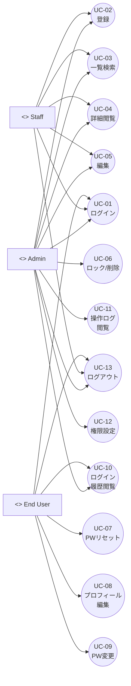

# ユースケース定義書（Use Case Specification）

# 1. 目的（Purpose）

本ユースケース定義書は、User Management System の要件定義書をもとに、  
各アクター（Admin / Staff / End User）がどのようにシステムを利用するかを整理し、  
画面設計・API 設計・テスト計画の基盤を提供する。

---

# 2. アクター一覧（Actors）

| アクターID | 名称       | 説明 |
|-----------|------------|------|
| AC-01     | Admin      | システム管理者。全機能にアクセス可能。 |
| AC-02     | Staff      | 担当領域内のユーザー管理を行う担当者。 |
| AC-03     | End User   | 自身のアカウントのみを管理する一般ユーザー。 |
| AC-04     | メールサービス | パスワードリセットメールを送信する外部サービス。 |

---

# 3. ユースケース一覧（Use Case List）

| UC-ID | ユースケース名 | 主アクター | 説明 |
|-------|----------------|------------|------|
| UC-01 | ログインする | Admin / Staff / End User | Email + Password による認証を行う |
| UC-02 | ユーザーを登録する | Admin / Staff | 新規ユーザーを作成する |
| UC-03 | ユーザー一覧を検索・閲覧する | Admin / Staff | 検索条件に応じて一覧を表示する |
| UC-04 | ユーザー詳細を閲覧する | Admin / Staff | 対象ユーザーの詳細情報を表示する |
| UC-05 | ユーザー情報を編集する | Admin / Staff | ユーザーの情報を更新する |
| UC-06 | ユーザーをロック / ソフト削除する | Admin | ユーザーアカウントを無効化・削除扱いにする |
| UC-07 | パスワードをリセットする | 全ロール | パスワード忘れ時の再設定機能 |
| UC-08 | プロフィールを閲覧・編集する | End User | 自身の基本情報を参照・更新する |
| UC-09 | パスワードを変更する（ログイン済み） | End User | 現在のパスワードを更新する |
| UC-10 | ログイン履歴を閲覧する | Admin / End User | ログイン記録を確認する |
| UC-11 | 操作ログを閲覧・検索する | Admin | CRUD 操作ログを検索・閲覧する |
| UC-12 | ロール・権限を設定・変更する | Admin | ロール定義と権限制御を設定する |
| UC-13 | ログアウトする | 全ロール | ログイン状態を終了する |

---

# 4. ユースケース詳細（Use Case Details）

---

## UC-01 ログインする

### 基本情報
- 主アクター：Admin / Staff / End User  
- 関連画面：EU-01 Login  
- 関連機能ID：AU-01, AU-02, AU-03, AU-05  

### 事前条件
- ユーザーが登録済みであること  
- status = active  

### 事後条件
- セッション生成  
- ログイン履歴記録  
- ロール別 Dashboard へ遷移  

### 基本フロー
1. アクターは Email と Password を入力する。  
2. システムは認証を行う。  
3. 成功した場合、ロールに応じて以下の画面へ遷移する：  
   - Admin → AD-01  
   - Staff → ST-01  
   - End User → EU-02  
4. システムはログイン履歴を記録する。  

### 代替フロー・例外
- パスワード誤り → 失敗回数を加算。  
- 規定回数超過 → status = locked に更新し、ログイン不可。  

---

## UC-02 ユーザーを登録する

### 基本情報
- 主アクター：Admin / Staff  
- 関連画面：AD-05 User Create  
- 機能ID：UM-01  

### 事前条件
- Admin / Staff がログイン済み。  
- Staff の場合、作成可能ロールや項目が権限制御される。  

### 事後条件
- users テーブルに新規ユーザーが作成される。  

### 基本フロー
1. アクターは AD-05「User Create」画面を開く。  
2. 必須項目（email, full_name, phone_number, role, status）を入力する。  
3. 任意項目（address, gender, date_of_birth, note 等）を必要に応じて入力する。  
4. システムはバリデーションを行う（email 一意、必須項目チェックなど）。  
5. 問題なければ DB に登録し、「登録しました」メッセージを表示する。  

### 代替フロー・例外
- email 重複 → 「このメールアドレスは既に登録されています」と表示。  
- 必須項目未入力 → エラー表示し、再入力を促す。  

---

## UC-03 ユーザー一覧を検索・閲覧する

### 基本情報
- 主アクター：Admin / Staff  
- 関連画面：AD-02（Admin User List）、ST-01（Staff User List）  
- 機能ID：UM-02  

### 事前条件
- Admin / Staff がログイン済み。  

### 事後条件
- 検索条件に応じたユーザー一覧が表示される。  
- ページネーションにより複数ページのユーザーを閲覧できる。  

### 基本フロー
1. アクターは User List 画面を開く。  
2. 検索条件（名前／メール／ロール／ステータス 等）を入力する。  
3. 「検索」ボタンを押下する。  
4. システムは権限制御を考慮しつつ、条件に一致するユーザーを抽出する。  
5. システムは一覧＋ページネーションを表示する。  
6. アクターは対象ユーザーをクリックし、UC-04（ユーザー詳細）へ遷移する。  

### 代替フロー・例外
- 検索条件未入力 → デフォルト一覧（全体または最近作成順）を表示。  
- 該当 0 件 → 「該当するユーザーは存在しません。」表示。  
- Staff が権限外ユーザーにアクセスしようとした場合 → 一覧に表示されない or アクセス拒否。  

---

## UC-04 ユーザー詳細を閲覧する

### 基本情報
- 主アクター：Admin / Staff  
- 関連画面：AD-03 / ST-02  
- 機能ID：UM-03  

### 事前条件
- Admin / Staff がログイン済み。  

### 事後条件
- 対象ユーザーの詳細情報が表示される。  

### 基本フロー
1. アクターはユーザー一覧（UC-03）から対象ユーザーを選択する。  
2. システムは users テーブルから対象ユーザー情報を取得する。  
3. システムは以下を含む詳細画面を表示する：  
   - full_name, email, phone_number, address, gender, date_of_birth  
   - role, status  
   - note, created_at, updated_at  
4. アクターは権限に応じて「編集」「ロック」「削除」などの操作を選択できる（UC-05, UC-06）。  

### 代替フロー・例外
- 対象ユーザー不存在 → エラー表示し、一覧へ戻す。  
- Staff が権限外ユーザーの URL に直接アクセス → 「権限がありません。」を表示。  

---

## UC-05 ユーザー情報を編集する

### 基本情報
- 主アクター：Admin / Staff  
- 関連画面：AD-04 / ST-03  
- 機能ID：UM-04  

### 事前条件
- ログイン済み。  
- Staff の場合、編集可能な項目が制限されている。  

### 事後条件
- 対象ユーザーの情報が更新される。  
- 操作ログに記録される。  

### 基本フロー
1. アクターはユーザー詳細画面（UC-04）から「編集」を選択する。  
2. 編集画面で許可されている項目を修正する。  
3. 「保存」ボタンを押下する。  
4. システムはバリデーションを行う。  
5. 問題なければ DB を更新し、「更新しました」を表示する。  

### 代替フロー・例外
- 権限外項目の更新要求 → バックエンドチェックで拒否。  
- 入力値不正（フォーマット違反など） → エラーメッセージ表示。  

---

## UC-06 ユーザーをロック / ソフト削除する

### 基本情報
- 主アクター：Admin  
- 関連画面：AD-03 / AD-04  
- 機能ID：UM-05, UM-06  

### 事前条件
- Admin がログイン済み。  
- 対象ユーザーが存在する。  

### 事後条件
- ロック：status = locked となり、ログイン不可。  
- ソフト削除：削除フラグ or status = inactive となり、通常一覧から除外。  
- 操作ログが記録される。  

### 基本フロー
1. Admin は対象ユーザーの詳細画面を表示する。  
2. 「ロック」または「削除」ボタンを押下する。  
3. システムは確認ダイアログを表示する。  
4. Admin が確定すると、システムは users レコードを更新する。  
5. システムは操作ログに記録し、結果メッセージを表示する。  

---

## UC-07 パスワードをリセットする（忘れた場合）

### 基本情報
- 主アクター：全ロール（Admin / Staff / End User）  
- 関連アクター：AC-04 メールサービス  
- 関連画面：EU-01（パスワードリセット導線）、パスワード再設定画面  
- 機能ID：UM-07, AU-02  

### 事前条件
- ユーザーは登録 email を知っているが、パスワードを忘れている。  
- メール送信機能が有効。  

### 事後条件
- 新パスワードが設定され、古いパスワードでログインできなくなる。  
- パスワード再設定操作がログ記録される（任意）。  

### 基本フロー
1. アクターは Login画面で「パスワードをお忘れですか？」をクリックする。  
2. システムは email 入力フォームを表示する。  
3. アクターは email を入力し送信する。  
4. システムは該当ユーザーを検索し、一時トークン付き再設定 URL を生成する。  
5. システムはメールサービス経由で再設定 URL を送信する。  
6. アクターはメールのリンクをクリックし、再設定画面を開く。  
7. 新パスワードと確認用パスワードを入力し、送信する。  
8. システムはパスワードポリシーをチェックし、問題なければパスワードハッシュを更新する。  

### 代替フロー・例外
- email 未登録 → 表示上は「メールを送信しました」とする（存在有無を隠蔽）。  
- 再設定リンク無効／期限切れ → 「リンクが無効です。再度パスワードリセットを行ってください。」表示。  
- パスワードポリシー違反 → エラー表示し、再入力を促す。  

---

## UC-08 プロフィールを閲覧・編集する（End User）

### 基本情報
- 主アクター：End User  
- 関連画面：EU-02 My Profile, EU-03 My Profile Edit  
- 機能ID：MP-01, MP-02  

### 事前条件
- End User がログイン済み。  

### 事後条件
- 自身のプロフィール情報が更新される。  

### 基本フロー
1. End User は EU-02「My Profile」を開く。  
2. 「編集」ボタンを押下し、EU-03「My Profile Edit」を表示する。  
3. 編集可能な項目（住所・電話・性別・生年月日・備考など）を修正する。  
4. 「更新」ボタンを押下する。  
5. システムはバリデーションを行い、問題なければ DB を更新する。  
6. システムは「更新しました」を表示し、EU-02 へ戻す。  

---

## UC-09 パスワードを変更する（ログイン済み）

### 基本情報
- 主アクター：End User  
- 関連画面：EU-04 Change Password  
- 機能ID：MP-03, AU-02  

### 事前条件
- End User がログイン済み。  
- アカウントが locked ではない。  

### 事後条件
- パスワードが新しい値に更新される。  
- 古いパスワードではログインできない。  

### 基本フロー
1. End User は EU-04「Change Password」を開く。  
2. 現在のパスワード、新しいパスワード、確認用パスワードを入力する。  
3. システムは現在のパスワードを検証する。  
4. 新パスワードがポリシーに適合しているかチェックする。  
5. DB のパスワードハッシュを更新する。  
6. 「パスワードを変更しました。」を表示し、必要に応じて再ログインを要求する。  

### 代替フロー・例外
- 現在パスワード誤り → エラー表示。  
- 新パスワードと確認用が一致しない → エラー表示。  
- ポリシー違反 → エラー表示。  

---

## UC-10 ログイン履歴を閲覧する

### 基本情報
- 主アクター：Admin / End User  
- 関連画面：AD-07 Audit Log（Admin）、EU-05 Login History（End User）  
- 機能ID：LG-01, LG-03, LG-04  

### 事前条件
- Admin または End User がログイン済み。  

### 事後条件
- Admin：全ユーザーまたは条件指定したログイン履歴を確認できる。  
- End User：自分自身のログイン履歴を確認できる。  

### 基本フロー
1. アクターはログイン履歴画面を開く。  
2. 期間やユーザーなど検索条件を入力する（Admin のみ）。  
3. システムはログイン履歴テーブルからデータを取得する。  
4. 結果を一覧表示し、必要に応じて詳細を表示する。  

---

## UC-11 操作ログを閲覧・検索する

### 基本情報
- 主アクター：Admin  
- 関連画面：AD-07 Audit Log  
- 機能ID：LG-02, LG-03, LG-04  

### 事前条件
- Admin がログイン済み。  
- システムが CRUD 操作ログを記録している。  

### 事後条件
- Admin が指定条件で操作ログを確認できる。  

### 基本フロー
1. Admin は AD-07「Audit Log」画面を開く。  
2. 期間・操作種別・操作者などの条件を入力する。  
3. 「検索」ボタン押下。  
4. システムはログテーブルから条件に合致するデータを取得する。  
5. 一覧および詳細を表示する。  

---

## UC-12 ロール・権限を設定・変更する

### 基本情報
- 主アクター：Admin  
- 関連画面：AD-06 Role & Permission Setting  
- 機能ID：RP-01, RP-02, RP-03  

### 事前条件
- Admin がログイン済み。  
- 初期ロール（Admin / Staff / End User）が存在する。  

### 事後条件
- ロールごとの権限が更新される。  
- 新規ロールを追加した場合、そのロールがユーザーに割り当て可能になる。  

### 基本フロー
1. Admin は AD-06 画面を開く。  
2. 既存ロール一覧を確認する。  
3. 各ロールごとに機能別の権限（View / Edit / Delete 等）を設定・変更する。  
4. 必要に応じて新しいロールを追加する。  
5. 「保存」を押下し、システムは roles / role_permissions 情報を更新する。  

### 代替フロー・例外
- 自身の Admin 権限を完全に外すような設定 → システムが拒否しエラー表示。  
- 矛盾する権限（Edit あるが View なし等） → バリデーションエラー。  

---

## UC-13 ログアウトする

### 基本情報
- 主アクター：全ロール  
- 関連画面：全画面（ログアウト後 EU-01 Login）  
- 機能ID：AU-05  

### 事前条件
- ユーザーがログイン済み。  

### 事後条件
- セッションが無効化される。  
- ログイン画面に遷移する。  

### 基本フロー
1. アクターは画面上部の「ログアウト」ボタンをクリックする。  
2. システムはサーバー側セッションを破棄する。  
3. システムは EU-01「Login」画面へリダイレクトする。  

### 代替フロー・例外
- セッションタイムアウト後にアクセスした場合 → 自動的にログイン画面へ遷移し、「セッションが切れました」等を表示。  

---

# 5. ユースケース図（Mermaid）

---
## ６. Change History（改版履歴）

| Version | 日付       | 内容                    | 担当 |
|---------|------------|-------------------------|------|
| 1.0     | 2025-12-08 | 初版作成              | DANG |