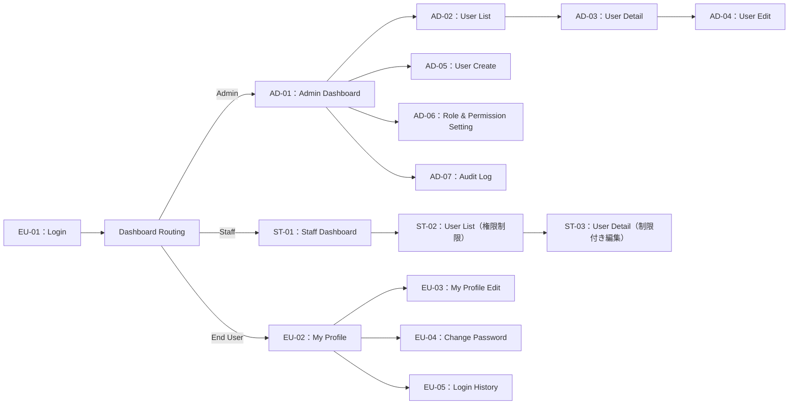
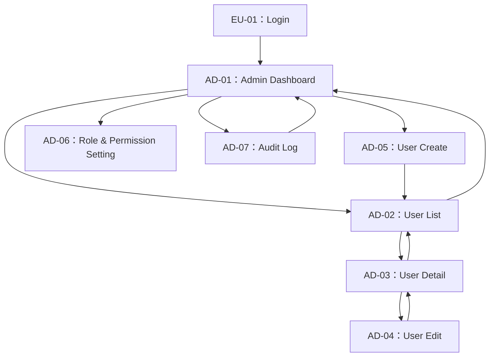
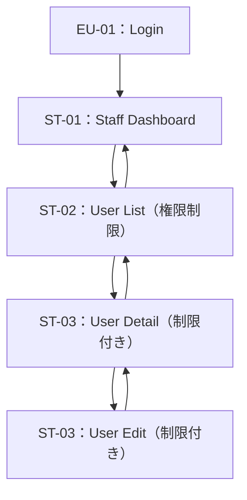
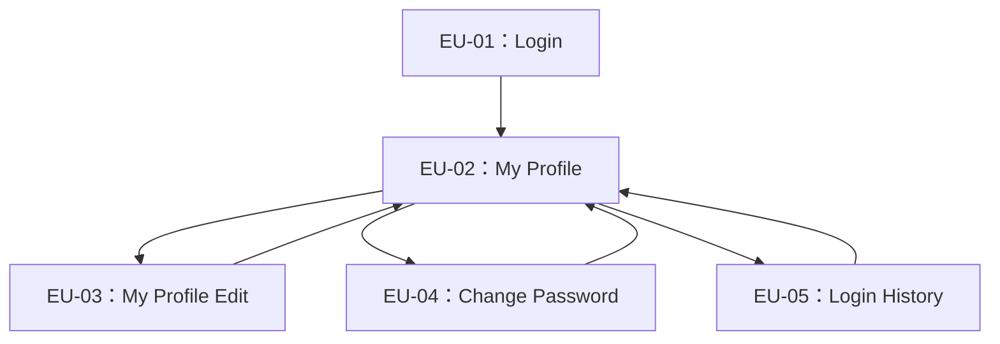

# 画面遷移図（Screen Transition Diagram）

本ドキュメントは、User Management System の画面遷移（Screen Flow）を整理したものである。  
要件定義書およびユースケース定義書をベースに、画面ID単位での遷移関係を明確化する。

---

## 1. 画面一覧（Screen List – 再掲）

### Admin

| 画面ID | 画面名                         | 説明                           |
|--------|--------------------------------|--------------------------------|
| AD-01  | Admin Dashboard                | 管理者用トップ画面             |
| AD-02  | User List                      | ユーザー一覧＋検索＋フィルタ＋ページネーション |
| AD-03  | User Detail                    | 個別ユーザー情報表示           |
| AD-04  | User Edit                      | ユーザー情報編集               |
| AD-05  | User Create                    | 新規ユーザー登録               |
| AD-06  | Role & Permission Setting      | ロール・権限設定               |
| AD-07  | Audit Log                      | 操作ログ／ログイン履歴の閲覧   |

### Staff

| 画面ID | 画面名        | 説明                           |
|--------|---------------|--------------------------------|
| ST-01  | User List     | 権限範囲内のユーザー一覧       |
| ST-02  | User Detail   | 権限範囲内のユーザー詳細       |
| ST-03  | User Edit     | 権限範囲内のユーザー編集       |

※ Staff は基本的に AD 系画面のサブセットとして実装される想定。

### End User

| 画面ID | 画面名           | 説明                     |
|--------|------------------|--------------------------|
| EU-01  | Login            | ログイン画面            |
| EU-02  | My Profile       | 自身の基本情報表示       |
| EU-03  | My Profile Edit  | プロフィール編集         |
| EU-04  | Change Password  | パスワード変更           |
| EU-05  | Login History    | 自身のログイン履歴表示   |

---

## 2. 全体画面遷移図（Overview）

システム全体の画面遷移（ロール別ルーティング含む）を示す。

---

## 3. Admin 画面遷移図（詳細）

Admin ロールに限定した画面遷移。

---

## 4. Staff 画面遷移図（詳細）

Staff は担当範囲内のみ閲覧・編集可能な前提。

---

## 5. End User 画面遷移図（詳細）

End User 用マイページ周りの遷移。

---

## 6. ログイン／ログアウト・セッション系の振る舞い（補足）

画面遷移では表現しきれないが、セッション系の挙動をテキストで補足する。

- ログイン成功時：  
  - セッション生成  
  - ロールに応じて Admin / Staff / End User の初期画面へ遷移  
- ログアウト時：  
  - セッション破棄  
  - EU-01：Login へ遷移  
- セッションタイムアウト時：  
  - 任意画面アクセス時にセッション無効を検知  
  - メッセージ表示後、EU-01：Login へリダイレクト  

---

## 7. Function / Use Case との対応関係（サマリ）

| 区分 | 対応ドキュメント | 説明 |
|------|------------------|------|
| 機能単位 | 要件定義書 4章（UM/RP/AU/LG/MP） | 機能レベルの要求定義 |
| 利用シナリオ単位 | ユースケース定義書（UC-01〜UC-13） | アクター視点の利用パターン |
| 画面単位 | 本ドキュメント（画面ID） | 画面遷移と入口/出口の整理 |

この 3 つを揃えることで、  
- 画面設計（画面項目定義、レイアウト）  
- API 設計（各画面の裏側 API）  
- テスト設計（画面遷移＋UCベースのシナリオテスト）  
にスムーズに進むことができる。

---

## 8. Change History

| Version | 日付       | 内容                    | 担当 |
|---------|------------|-------------------------|------|
| 1.0     | 2025-12-09 | 初版作成（画面遷移図整理） | DANG |
