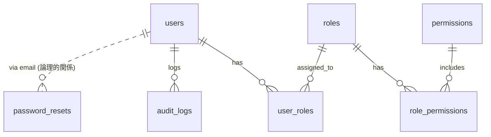
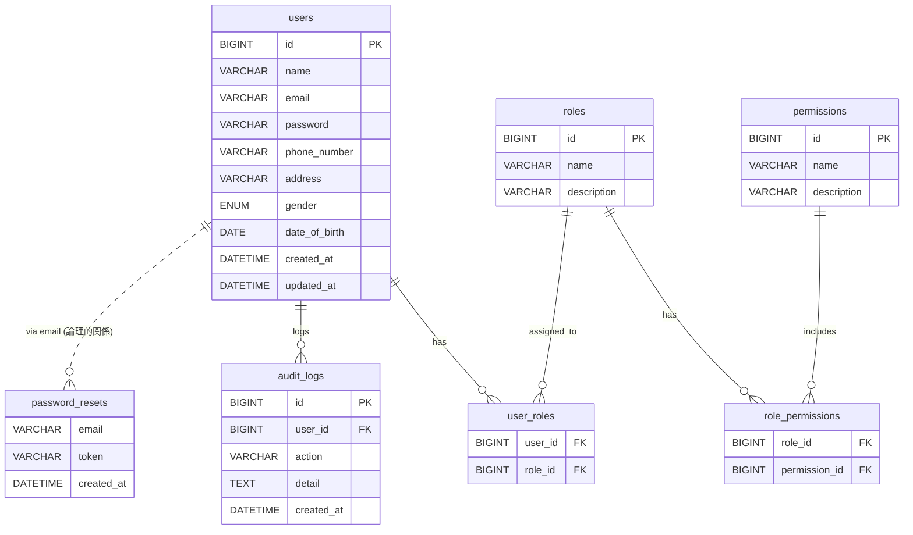

# DB定義書（Database Definition Document）

本ドキュメントは、User Management System のデータベース構造を定義する。  
テーブル一覧、各テーブルの項目定義、制約、リレーションを明確化する。

---

# 1. テーブル一覧（Table List）

| No | テーブル名 | 物理名 | 説明 |
|----|------------|--------|------|
| 1 | 会員テーブル | users | 会員（ユーザー）情報を管理 |
| 2 | パスワードリセット | password_resets | パスワード再設定用トークン管理 |
| 3 | ロールマスタ | roles | ロール（権限グループ）を管理 |
| 4 | ユーザーロール | user_roles | ユーザーとロールの紐付け |
| 5 | 権限マスタ | permissions | 権限（操作レベル）を管理 |
| 6 | ロール権限 | role_permissions | ロールと権限の紐付け |
| 7 | 監査ログ | audit_logs | ユーザー操作ログを保持 |

---

# 2. テーブル定義（Table Definitions）

---

## 2.1. users（会員テーブル）

### ■ 概要  
会員情報を管理するメインテーブル。

### ■ 項目一覧

| No | 項目名 | 物理名 | 型 | 桁 | NotNull | Key | Default | 説明 |
|----|--------|--------|----|-----|---------|-----|---------|------|
| 1 | 会員ID | id | BIGINT | - | YES | PK | AUTO_INCREMENT | 主キー |
| 2 | 氏名 | name | VARCHAR | 255 | YES | | | |
| 3 | メールアドレス | email | VARCHAR | 255 | YES | UNIQUE | | ログインIDとして使用 |
| 4 | パスワード | password | VARCHAR | 255 | YES | | | ハッシュ化保存 |
| 5 | 電話番号 | phone_number | VARCHAR | 13 | YES | | | |
| 6 | 住所 | address | VARCHAR | 255 | NO | | | |
| 7 | 性別 | gender | ENUM('male','female') | - | NO | | NULL | |
| 8 | 生年月日 | date_of_birth | DATE | - | NO | | NULL | |
| 9 | 作成日時 | created_at | DATETIME | - | YES | | CURRENT_TIMESTAMP | |
| 10 | 更新日時 | updated_at | DATETIME | - | NO | | CURRENT_TIMESTAMP | ON UPDATE |

---

## 2.2. password_resets（パスワードリセット）

| No | 項目名 | 物理名 | 型 | 桁 | NotNull | Key | Default | 説明 |
|----|--------|--------|----|-----|---------|-----|---------|------|
| 1 | メールアドレス | email | VARCHAR | 255 | YES | INDEX | | |
| 2 | トークン | token | VARCHAR | 255 | YES | | | |
| 3 | 作成日時 | created_at | DATETIME | - | YES | | CURRENT_TIMESTAMP | |

---

## 2.3. roles（ロールマスタ）

| No | 項目名 | 物理名 | 型 | 桁 | NotNull | Key | 説明 |
|----|--------|--------|----|-----|---------|-----|------|
| 1 | ロールID | id | BIGINT | - | YES | PK | |
| 2 | ロール名 | name | VARCHAR | 100 | YES | UNIQUE | |
| 3 | 説明 | description | VARCHAR | 255 | NO | | |

---

## 2.4. user_roles（ユーザーロール）

ユーザーとロールの多対多中間テーブル。

| No | 項目名 | 物理名 | 型 | NotNull | Key | 説明 |
|----|--------|--------|----|---------|-----|------|
| 1 | 会員ID | user_id | BIGINT | YES | FK | |
| 2 | ロールID | role_id | BIGINT | YES | FK | |

**制約**  
- PK(user_id, role_id)  
- FK(user_id) → users.id  
- FK(role_id) → roles.id  

---

## 2.5. permissions（権限マスタ）

| No | 項目名 | 物理名 | 型 | 桁 | NotNull | Key | 説明 |
|----|--------|--------|----|-----|---------|-----|------|
| 1 | 権限ID | id | BIGINT | - | YES | PK | |
| 2 | 権限名 | name | VARCHAR | 100 | YES | UNIQUE | |
| 3 | 説明 | description | VARCHAR | 255 | NO | | |

---

## 2.6. role_permissions（ロール権限）

| No | 項目名 | 物理名 | 型 | NotNull | Key |
|----|--------|--------|----|---------|-----|
| 1 | ロールID | role_id | BIGINT | YES | FK |
| 2 | 権限ID | permission_id | BIGINT | YES | FK |

制約  
- PK(role_id, permission_id)  
- FK(role_id) → roles.id  
- FK(permission_id) → permissions.id  

---

## 2.7. audit_logs（監査ログ）

| No | 項目名 | 物理名 | 型 | 桁 | NotNull | Key | 説明 |
|----|--------|--------|----|-----|---------|-----|------|
| 1 | ログID | id | BIGINT | - | YES | PK | |
| 2 | ユーザーID | user_id | BIGINT | NO | FK | |
| 3 | アクション名 | action | VARCHAR | 100 | YES | | 例：LOGIN, UPDATE_PROFILE |
| 4 | 詳細 | detail | TEXT | - | NO | | JSON形式可 |
| 5 | 作成日時 | created_at | DATETIME | YES | | CURRENT_TIMESTAMP |

---

# 3. リレーション図（ERD）

## Logical ERD

## Physical ERD

---

# 4. 命名規則（Naming Rules）

| 種類 | 規則 |
|------|------|
| テーブル名 | スネークケース（複数形）例：users |
| カラム名 | スネークケース |
| PK | id |
| FK | {table}_id |
| 日時 | created_at / updated_at |
| ENUM | 英字小文字 |

---

# 5. 今後の拡張案

- MFA（多要素認証）テーブル追加  
- ログイン履歴テーブル login_history  
- セッション管理テーブル user_sessions  
- メール送信ログ mail_logs  

---
## 6. Change History

| Version | 日付       | 内容                    | 担当 |
|---------|------------|-------------------------|------|
| 1.0     | 2025-12-09 | 初版作成（DB定義整理） | DANG |