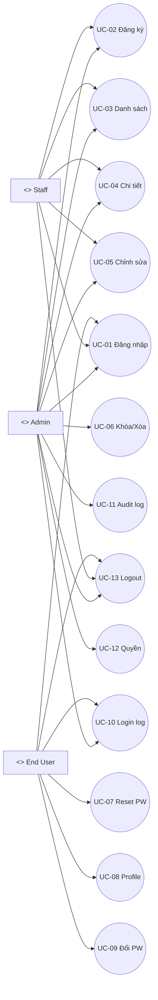

# TÀI LIỆU ĐỊNH NGHĨA USE CASE（Use Case Specification）

---

## 1. Mục đích (Purpose)

Tài liệu Use Case này được xây dựng dựa trên Tài liệu Yêu cầu Hệ thống (System Requirement Specification) của **User Management System**.

Mục tiêu là:
- Làm rõ cách **mỗi Actor (Admin / Staff / End User)** sử dụng hệ thống
- Làm cơ sở cho:
  - Thiết kế màn hình (UI Design)
  - Thiết kế API
  - Lập kế hoạch test (Test Plan)

---

## 2. Danh sách Actor (Actors)

| Actor ID | Tên | Mô tả |
|--------|-----|------|
| AC-01 | Admin | Quản trị hệ thống. Có quyền truy cập toàn bộ chức năng. |
| AC-02 | Staff | Nhân viên phụ trách quản lý người dùng trong phạm vi được phân quyền. |
| AC-03 | End User | Người dùng thông thường, chỉ quản lý tài khoản của chính mình. |
| AC-04 | Dịch vụ Email | Dịch vụ bên ngoài dùng để gửi email reset mật khẩu. |

---

## 3. Danh sách Use Case (Use Case List)

| UC-ID | Tên Use Case | Actor chính | Mô tả |
|------|-------------|------------|------|
| UC-01 | Đăng nhập | Admin / Staff / End User | Xác thực bằng Email + Password |
| UC-02 | Đăng ký người dùng | Admin / Staff | Tạo mới người dùng |
| UC-03 | Tìm kiếm / xem danh sách người dùng | Admin / Staff | Hiển thị danh sách theo điều kiện |
| UC-04 | Xem chi tiết người dùng | Admin / Staff | Hiển thị thông tin chi tiết |
| UC-05 | Chỉnh sửa thông tin người dùng | Admin / Staff | Cập nhật thông tin |
| UC-06 | Khóa / xóa mềm người dùng | Admin | Vô hiệu hóa hoặc xóa logic |
| UC-07 | Reset mật khẩu | Tất cả | Quên mật khẩu |
| UC-08 | Xem / chỉnh sửa hồ sơ cá nhân | End User | Quản lý thông tin cá nhân |
| UC-09 | Đổi mật khẩu (đã đăng nhập) | End User | Thay đổi mật khẩu |
| UC-10 | Xem lịch sử đăng nhập | Admin / End User | Kiểm tra lịch sử |
| UC-11 | Xem / tìm kiếm log thao tác | Admin | Audit log |
| UC-12 | Thiết lập vai trò & quyền | Admin | Quản lý role & permission |
| UC-13 | Đăng xuất | Tất cả | Kết thúc phiên đăng nhập |

---

## 4. Chi tiết Use Case (Use Case Details)

---

### UC-01 Đăng nhập

**Actor chính**: Admin / Staff / End User  
**Màn hình liên quan**: EU-01 Login

**Điều kiện trước**:
- Người dùng đã được đăng ký
- Trạng thái tài khoản = active

**Điều kiện sau**:
- Tạo session đăng nhập
- Ghi log đăng nhập
- Chuyển đến Dashboard theo role

**Luồng chính**:
1. Người dùng nhập Email và Password
2. Hệ thống thực hiện xác thực
3. Nếu thành công:
   - Admin → AD-01
   - Staff → ST-01
   - End User → EU-02
4. Ghi nhận lịch sử đăng nhập

**Ngoại lệ**:
- Sai mật khẩu → tăng số lần thất bại
- Quá số lần quy định → khóa tài khoản

---

### UC-02 Đăng ký người dùng

**Actor chính**: Admin / Staff  
**Màn hình**: AD-05 User Create

**Điều kiện trước**:
- Đã đăng nhập
- Staff bị giới hạn quyền tạo

**Điều kiện sau**:
- Tạo bản ghi mới trong bảng users

**Luồng chính**:
1. Mở màn hình tạo người dùng
2. Nhập các trường bắt buộc (email, tên, role, status…)
3. Nhập các trường tùy chọn nếu cần
4. Thực hiện validation
5. Lưu DB và hiển thị thông báo thành công

**Ngoại lệ**:
- Trùng email → báo lỗi
- Thiếu trường bắt buộc → yêu cầu nhập lại

---

### UC-03 Xem / tìm kiếm danh sách người dùng

**Thông tin cơ bản**  
- Actor chính: Admin / Staff  
- Màn hình liên quan: AD-02 (Admin User List), ST-01 (Staff User List)  
- Function ID: UM-02

**Điều kiện trước**  
- Admin hoặc Staff đã đăng nhập.

**Điều kiện sau**  
- Danh sách người dùng phù hợp điều kiện tìm kiếm được hiển thị.  
- Có thể phân trang để xem nhiều trang dữ liệu.

**Luồng chính**  
1. Actor mở màn hình User List.  
2. Nhập điều kiện tìm kiếm (tên / email / role / status…).  
3. Nhấn nút "Tìm kiếm".  
4. Hệ thống áp dụng kiểm soát quyền và trích xuất dữ liệu phù hợp.  
5. Hệ thống hiển thị danh sách + phân trang.  
6. Actor chọn một user và chuyển sang UC-04.

**Luồng thay thế / Ngoại lệ**  
- Không nhập điều kiện → hiển thị danh sách mặc định.  
- Không có kết quả → hiển thị thông báo "Không có người dùng phù hợp".  
- Staff truy cập user ngoài quyền → không hiển thị hoặc bị từ chối.

---

### UC-04 Xem chi tiết người dùng

**Thông tin cơ bản**  
- Actor chính: Admin / Staff  
- Màn hình: AD-03 / ST-02  
- Function ID: UM-03

**Điều kiện trước**  
- Admin hoặc Staff đã đăng nhập.

**Điều kiện sau**  
- Thông tin chi tiết của user được hiển thị.

**Luồng chính**  
1. Actor chọn user từ danh sách (UC-03).  
2. Hệ thống lấy dữ liệu user từ bảng users.  
3. Hiển thị thông tin chi tiết gồm: full_name, email, phone, address, gender, DOB, role, status, note, created_at, updated_at.  
4. Actor có thể chọn các thao tác tiếp theo (UC-05, UC-06).

**Luồng thay thế / Ngoại lệ**  
- User không tồn tại → hiển thị lỗi và quay lại danh sách.  
- Staff truy cập URL ngoài quyền → hiển thị "Không có quyền truy cập".

---

### UC-05 Chỉnh sửa thông tin người dùng

**Thông tin cơ bản**  
- Actor chính: Admin / Staff  
- Màn hình: AD-04 / ST-03  
- Function ID: UM-04

**Điều kiện trước**  
- Đã đăng nhập.  
- Staff chỉ được chỉnh sửa các trường được phân quyền.

**Điều kiện sau**  
- Thông tin user được cập nhật.  
- Ghi log thao tác.

**Luồng chính**  
1. Actor chọn "Chỉnh sửa" từ màn hình chi tiết.  
2. Cập nhật các trường cho phép.  
3. Nhấn "Lưu".  
4. Hệ thống validation dữ liệu.  
5. Cập nhật DB và hiển thị thông báo thành công.

**Luồng thay thế / Ngoại lệ**  
- Chỉnh sửa trường ngoài quyền → backend từ chối.  
- Dữ liệu không hợp lệ → hiển thị lỗi.

---

### UC-06 Khóa / xóa mềm người dùng

**Thông tin cơ bản**  
- Actor chính: Admin  
- Màn hình: AD-03 / AD-04  
- Function ID: UM-05, UM-06

**Điều kiện trước**  
- Admin đã đăng nhập.  
- User tồn tại.

**Điều kiện sau**  
- Khóa: status = locked.  
- Xóa mềm: status = inactive hoặc flag delete.  
- Ghi log thao tác.

**Luồng chính**  
1. Admin mở màn hình chi tiết user.  
2. Chọn "Khóa" hoặc "Xóa".  
3. Hiển thị dialog xác nhận.  
4. Xác nhận → cập nhật DB.  
5. Ghi log và hiển thị kết quả.

---

### UC-07 Reset mật khẩu (quên mật khẩu)

**Thông tin cơ bản**  
- Actor: Tất cả  
- Actor phụ: Dịch vụ Email  
- Function ID: UM-07, AU-02

**Điều kiện trước**  
- Biết email đăng ký.

**Điều kiện sau**  
- Mật khẩu mới được cập nhật.  
- Mật khẩu cũ không còn hiệu lực.

**Luồng chính**  
1. Chọn "Quên mật khẩu" tại màn hình Login.  
2. Nhập email và gửi.  
3. Hệ thống tạo token và URL reset.  
4. Gửi email reset.  
5. Người dùng truy cập link, nhập mật khẩu mới.  
6. Hệ thống cập nhật hash mật khẩu.

**Luồng thay thế / Ngoại lệ**  
- Email không tồn tại → vẫn hiển thị "Đã gửi email".  
- Link hết hạn → yêu cầu reset lại.  
- Vi phạm policy mật khẩu → báo lỗi.

---

### UC-08 Xem / chỉnh sửa hồ sơ cá nhân

**Thông tin cơ bản**  
- Actor: End User  
- Màn hình: EU-02, EU-03  
- Function ID: MP-01, MP-02

**Luồng chính**  
1. Mở My Profile.  
2. Chọn chỉnh sửa.  
3. Cập nhật thông tin cho phép.  
4. Lưu và hiển thị thông báo.

---

### UC-09 Đổi mật khẩu (đã đăng nhập)

**Thông tin cơ bản**  
- Actor: End User  
- Màn hình: EU-04  
- Function ID: MP-03

**Luồng chính**  
1. Nhập mật khẩu hiện tại.  
2. Nhập mật khẩu mới + xác nhận.  
3. Validation và cập nhật DB.

---

### UC-10 Xem lịch sử đăng nhập

**Thông tin cơ bản**  
- Actor: Admin / End User  
- Màn hình: AD-07 / EU-05  
- Function ID: LG-01, LG-03, LG-04

**Luồng chính**  
1. Mở màn hình lịch sử đăng nhập.  
2. (Admin) nhập điều kiện tìm kiếm.  
3. Hệ thống hiển thị danh sách log.

---

### UC-11 Xem / tìm kiếm log thao tác

**Thông tin cơ bản**  
- Actor: Admin  
- Màn hình: AD-07  
- Function ID: LG-02, LG-03, LG-04

**Luồng chính**  
1. Nhập điều kiện (thời gian, hành động…).  
2. Tìm kiếm và hiển thị log.

---

### UC-12 Thiết lập role & permission

**Thông tin cơ bản**  
- Actor: Admin  
- Màn hình: AD-06  
- Function ID: RP-01, RP-02, RP-03

**Luồng chính**  
1. Mở màn hình role & permission.  
2. Chỉnh sửa quyền theo role.  
3. Lưu thay đổi.

**Ngoại lệ**  
- Gỡ toàn bộ quyền Admin → bị từ chối.

---

### UC-13 Đăng xuất

**Thông tin cơ bản**  
- Actor: Tất cả  
- Màn hình: Toàn bộ (sau logout về EU-01)  
- Function ID: AU-05

**Luồng chính**  
1. Nhấn "Đăng xuất".  
2. Hủy session.  
3. Chuyển về màn hình Login.

---

## 5. Sơ đồ Use Case (Mermaid)

---

## 6. Lịch sử thay đổi (Change History)

| Version | Ngày | Nội dung | Người thực hiện |
|--------|------|---------|----------------|
| 1.0 | 2025-12-08 | Hoàn thiện bản tiếng Việt | DANG |

